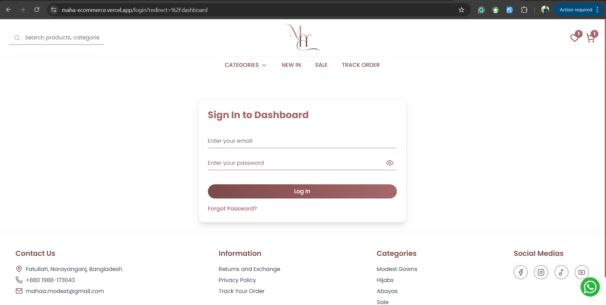

# Maha E-Commerce 🛍️  
A full-stack, production-ready E-Commerce web application built with **Next.js**, featuring a powerful admin dashboard, real-time product management, secure payments, and customer order tracking.

## 🚀 Tech Stack
- **Frontend:** Next.js (App Router), TypeScript, Tailwind CSS  
- **Database & Admin CMS:** Sanity  
- **Authentication:** Firebase Auth  
- **Backend:** Next.js Server Routes  
- **Payments:** SSLCommerz (Easy Checkout)  
- **Orders Storage:** Firebase Firestore  
- **Emails:** Nodemailer  
- **Admin Dashboard:** Recharts + Custom UI  
- **Session Handling:** Middleware + Cookies  

---

## 🔥 Key Features

### 🛒 Storefront
- Fully functional e-commerce experience  
- Dynamic product listing and product detail pages  
- Products managed in **Sanity CMS**  
- Real-time updates without needing code changes

### 💳 Secure Online Payments
- Integrated **SSLCommerz Easy Checkout**
- Successful transactions automatically recorded in Firebase Firestore

### 📦 Order Management System (OMS)
- Customers can:
  - View their order history  
  - Track order status live  
- All data fetched directly from Firestore

### 🛡️ Admin Panel
- Admin authentication with **Firebase Auth**
- Protected routes using middleware + cookies  
- Admin features include:
  - Sales analytics dashboard (Recharts)
  - Order management and tracking
  - Connected to Sanity for product inventory and data

### ✉️ Automatic Email Notifications
- Order confirmations sent using **Nodemailer**
- Customers receive real-time purchase emails

---

## 🖼️ Screenshots

<!-- ### Admin Dashboard  
 -->

### Login Screen  


<!-- ### SSLCommerz Payment  
 -->

---

## 🧑‍💻 Getting Started

Install dependencies:

```bash
npm run dev
# or
yarn dev
# or
pnpm dev
# or
bun dev
```
Open [http://localhost:3000](http://localhost:3000) with your browser to see the result.